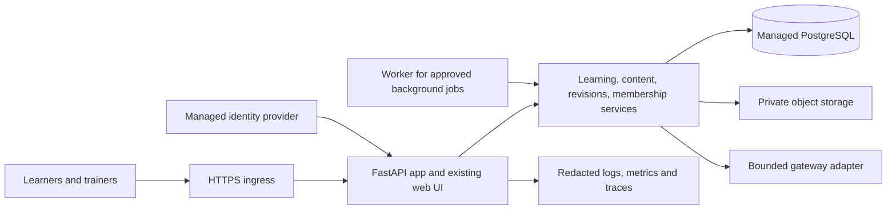

# AgentX Learn — product and production delivery plan

Planning baseline: 8 October 2026; updated 10 October, Singapore. Status: demo delivery in progress;
production controls below are future requirements, not current capabilities.

The agreed release is a fictional-data demo. No company has joined yet. Company
identity, employee data, service commitments and a production launch remain deferred.
Keep hosting costs low; select a provider only after comparing dated cost estimates.
The owner will arrange a volunteer and trainer for the first human pilot session.

## 1. Product decision

Build a supported procedure-readiness product for small and medium teams: employees
learn approved procedures, demonstrate critical steps on fresh cases, and receive
targeted retraining when a trainer approves a procedure change. Trainers can inspect
the evidence and intervene. A successful release must be deployable, recoverable,
maintainable and safely upgradeable, as well as useful to learners.

First production boundary: one invited organization, one approved procedure,
identified employees and a responsible trainer. Use a dedicated deployment/database
for that organization initially. Add shared multi-organization hosting only after
explicit isolation requirements and tests are satisfied. Do not promise certification,
general learning effectiveness or measured savings based on prototype results.

Preserve FastAPI and the existing frontend while improving their structure. A React
rewrite, microservices and Kubernetes are not prerequisites for this product's first
supported deployment. Retain deterministic scoring and human content approval.

## 2. Current position and gaps

| Area | Existing evidence | Work required for supported production |
| --- | --- | --- |
| Learning workflow | Diagnostics, focused lessons, fresh cases, saved objective evidence, critical gates | Validated company content; assignments, enrollment and lifecycle rules |
| Procedure updates | Reviewed mappings, carried evidence, targeted refreshers, preserved history | Version lifecycle, withdrawal incidents, effective dates and operational ownership |
| AI | Bounded typed tools, explicit failure, citation-ID validation, gateway adapter | Held-out quality evaluation, latency/cost telemetry, approved provider/data handling |
| Identity | Local demo accounts, learner/trainer roles, session cookies | Managed identity, real memberships, scoped authorization and account offboarding |
| Persistence | SQLite, additive startup migrations, isolated rehearsals and container backup/restore smoke checks | Managed PostgreSQL, explicit migrations, production recovery targets and historical import rehearsal |
| Frontend | Vanilla JavaScript; automated desktop, mobile, keyboard and trainer publication journeys | Broader accessibility review, component boundaries and human usability evidence |
| Deployment | Non-root Docker/Compose demo, persistent volume, tested container recovery and allowlisted ZIP | Hosted staging, infrastructure as code, image promotion, production release pipeline and rollback |
| Tests | Backend Python, 15 Chromium browser and 2 Node dashboard tests; container, upgrade and capacity jobs in CI | Production DB tests, sustained load, security, production recovery and human pilot |
| Operations | Main-database readiness, generated request IDs, metadata-only HTTP logs, versioned demo release record and operator guide | Hosted telemetry retention, dashboards, alerts, production support and incident drills |
| Dependencies | Hashed runtime, developer and browser lockfiles; layered update command and manual monthly review procedure; test tools excluded from runtime image | Scheduled update PRs and upgrade compatibility evidence |
| Packaging | Explicit source allowlist; ZIP/checksum build in CI; manifest, link and exclusion regressions on Windows/Linux | Owner retains selected artifact and records its actual installation; private pilot records stay excluded |

Primary scope is `employee-training-assistant` in [KaenBin/AgentX](https://github.com/KaenBin/AgentX).
`dev` is the integration branch and `master` is production. Both have owner-controlled
rulesets. Create feature branches from `dev`, open PRs toward `dev`, and request review.
Only the owner merges; the owner also controls promotion from `dev` to `master`.
The sibling framework and `agentx-training` are reference work, outside this delivery.

The demo foundation landed in [PR #2](https://github.com/KaenBin/AgentX/pull/2)
and browser regression coverage in [PR #3](https://github.com/KaenBin/AgentX/pull/3).
See [DEMO-DEPLOYMENT.md](DEMO-DEPLOYMENT.md) for the supported local container
workflow and [BROWSER-TESTING.md](BROWSER-TESTING.md) for browser CI scope.
Demo operability is described in [DEMO-OPERATIONS.md](DEMO-OPERATIONS.md) and
[RELEASES.md](RELEASES.md), with validation limitations recorded per candidate.
Automated checks and fixture rehearsals do not replace human pilot results.

## 3. Users, outcomes and success measures

| User | Required outcome | Product measure |
| --- | --- | --- |
| Learner | Knows what to do next, why, and which procedure version applies | Unassisted journey completion; fresh critical-case results; clarity rating |
| Trainer | Publishes trustworthy content and resolves actual gaps | Review/correction effort; unresolved-review age; source-supported answer rate |
| Organization administrator | Assigns access and procedures to the right people | Enrollment coverage; access correctness; offboarding completion |
| Operator/support | Can deploy, identify failures, recover data and update safely | Availability, recovery drills, release failure rate, incident resolution |

Definitions must be stable: app readiness, independent held-out performance,
course completion and procedure-version currency are different measures. Include
employees without sessions in assignment reporting; current dashboard session
counts cannot be interpreted as organization-wide coverage.

Before the pilot, approve criteria from PILOT-TEST-PLAN.md. Before production,
baseline actual usage and agree the operating targets below. Report raw counts
and missing observations. Add product events without collecting raw policy/chat
text by default. Do not use pilot records to make employee eligibility decisions.

## 4. Requirements and scope

### Required for the first supported release

- Invitation/SSO onboarding, membership roles, organization boundaries and offboarding.
- Assigned procedure versions, clear pending/ready/blocked states and history.
- Trainer source approval, publication, evidence review, saved guidance and revisions.
- Approved text/Markdown import with size limits and explicit content validation.
- Strict source-scoped retrieval; clear unsupported answers and AI outage behavior.
- Versioned deterministic scoring; submission idempotency and concurrency protection.
- Accessible core journeys, loading states, retry paths and actionable errors.
- Durable storage, staged releases, tested backups, monitoring and support documentation.
- Configurable retention/export/deletion with preservation rules for required evidence.
- Admin usage budgets, provider timeout limits and a way to disable AI calls safely.

### Later, after evidence supports investment

PDF/DOCX ingestion with scanning and extraction review; semantic retrieval;
notifications; additional procedures; shared multi-tenant hosting; additional
languages; enterprise identity integrations; short-answer scoring; LMS integrations;
commercial billing. Each requires its own acceptance criteria and cost justification.
Keep held-out pilot short answers manually scored; do not quietly turn them into
an automatic grading feature.

## 5. Architecture target

Use a modular application with explicit domain services and repository interfaces.
Move orchestration out of route handlers; keep HTTP schemas, domain state and database
records distinct. Make dependency injection and database selection explicit instead
of relying on global mutable paths. Do not carry filesystem-per-browser rehearsal
switching into production request handling.

The worker is introduced only for long imports, bulk assignments and notifications;
ordinary learning writes remain transactional. Add retries with idempotent job keys,
dead-letter handling, visibility and cancellation. Never enqueue a second scoring
write on a timeout without checking the existing activity result.

An AWS reference option for later comparison: ECS Fargate
service behind HTTPS ingress; managed PostgreSQL; private object storage; secret
manager; managed identity provider; container registry and infrastructure as code.
Run production database connectivity privately. Keep the current approved model
gateway as an adapter until its ownership and service guarantees are established.
This is an example, not a provider selection. Compare simpler managed application
hosting plus PostgreSQL against it, including backups and operational effort, before
the owner approves a hosting budget and architecture decision.

Use at least two application instances for the proposed availability target. Choose
database availability configuration deliberately and include its cost. Keep staging
and production isolated by accounts/projects or strongly separated resources and
credentials. Development runs locally with reproducible fixtures; staging uses
sanitized data. Do not place SQLite on an ephemeral container filesystem.

ECS supports deployment failure detection and rollback for supported deployment
configurations; configure and rehearse that capability rather than assuming a
container replacement guarantees a safe release. [AWS deployment circuit breaker](https://docs.aws.amazon.com/AmazonECS/latest/developerguide/deployment-circuit-breaker.html).

## 6. Data, identity and authorization

Document an entity map for organizations, users, memberships, assignments, procedures,
source versions, course versions, objectives, activities, submissions, evidence,
revision mappings, review requests and audit events. Define stable IDs and foreign
keys. Every protected record, query, export and model retrieval must resolve its
organization and authorization scope. Route role checks alone are insufficient.

- Learner: own assigned content, sessions, questions and progress only.
- Trainer: assigned organization content and authorized learner evidence.
- Administrator: memberships and assignments; content approval only if also trainer.
- Platform support: audited, time-limited access; no blanket content access by default.

Integrate a managed OIDC provider. Validate issuer, audience, expiry and signatures;
map identities to explicit memberships. Define logout/revocation and offboarding
behavior. Harden session cookies behind the actual proxy configuration, CSRF handling,
origin checks, rate limits and authorization on every read/write path. Disable shared
demo users, seed policies and rehearsal endpoints in production; production startup
must refuse demo configuration. Keep demo deployment isolated and visibly labeled.

Version SQL migrations explicitly, for example using SQLAlchemy/Alembic after
introducing the repository layer. Alembic provides database change-management scripts;
generated migrations still require review. [Alembic tutorial](https://alembic.sqlalchemy.org/en/latest/tutorial.html).

SQLite-to-PostgreSQL migration must preserve IDs, procedure relationships, scores,
decision records and carried-evidence links. Validate row counts, relationship checks
and representative replay, not just successful SQL execution. Snapshot the source,
rehearse on a copy, freeze writes for the final small-deployment cutover, migrate,
validate and switch. Abort before new production writes if validation fails. Once
new writes exist, do not roll back by silently restoring the old SQLite snapshot.

Use expand/backfill/contract migrations: add compatible structures, deploy code that
handles both, backfill with recorded checks, and remove old structures in a later
release. Run migrations as one controlled deployment job with locking, not in every
web worker at startup. Flag irreversible changes and test restore/forward-repair paths.

## 7. Three kinds of updates

| Update | Versioned inputs | Validation | Recovery |
| --- | --- | --- | --- |
| Application release | Commit, image digest, dependencies, schema migrations, config contract | CI, staging, compatibility and smoke tests | Previous compatible image; forward database repair where needed |
| Procedure/content release | Source, course, objective bank, rubric, equivalence mapping, approver, effective time | Trainer review; source consistency; fresh-case and stale-version checks | Withdraw/block bad content; publish reviewed correction; preserve history |
| AI release | Provider/model, prompt, tool schemas, retrieval settings, limits, eval dataset | Held-out grounded-answer and tool-action evaluation; latency/cost checks | Restore approved AI config; disable calls with explicit user messaging |

Do not overwrite published content, prompts referenced by evidence, or historical
grades. A content correction may require reassessment and a recorded incident.
Application rollback does not undo assigned refreshers. Model rollback does not
validate answers already delivered. Store versions needed to explain each decision.

API contracts and exports need versioning and compatibility tests. Publish changelogs,
migration notes and known limitations. Notify trainers about changes affecting their
content or learners; preserve unaffected workflows where possible. Use feature flags
for controlled rollout, with owners and removal dates. Define support for the current
release and a limited previous compatible application release; set actual support
windows before launch. Test upgrades from the previous supported release.

## 8. AI quality, content governance and safety

Keep grading, approval, assignment activation and readiness transitions backend-owned.
Maintain allowlisted read tools and bounded action selection. Enforce scope before
retrieval and before responding; sources are data, never instructions. Evaluate prompt
injection, conflicting versions, withdrawn content and cross-user/organization requests.

Build a versioned evaluation set. A proposed initial target is 30 answerable and 10
unsupported questions plus workflow, injection and access cases; the trainer must
approve its scope before use. This corpus has not been built and is separate from the
participant pilot forms. Reserve evaluation
cases from training banks. Trainer reviews claim support against passages; citation
ID validity alone is insufficient. Set approval criteria before running evaluations;
record failures and exact configuration. A small smoke sample cannot establish an
unsupported-answer reliability rate.

Record gateway calls, latency, bounded retries, failures and usage where returned.
Treat unavailable token/cost figures as unknown, never zero. Approve daily/monthly
usage limits per organization and per user. Stop new AI work at a hard budget limit;
deterministic learning and grading should remain available. Never silently relabel
offline selection as model behavior. Cache only where organization, permissions,
procedure version and retention are respected; reassess cached content on withdrawal.

For case-bank exhaustion, provide a trainer-visible action to author and approve new
cases or a new course version. Do not recycle exposed cases as fresh evidence.
Define content owners, review dates, effective dates, deprecation, emergency withdrawal
and policy conflict resolution before real material is loaded.

## 9. Quality engineering and developer experience

Create one documented local setup and command set. Pin runtime/build dependencies and
produce a reviewed lockfile. Separate runtime and development requirements. Normalize
formatting/lint gradually; introduce type checks for changed domain code first.
Add module ownership, contribution instructions, architecture decisions and API docs.
Secrets and private pilot databases must remain outside source and artifacts.

Target CI for supported-production pull requests (several checks remain future work):

1. Locked dependency installation and environment validation.
2. Formatting/lint and scoped typing; secret and dependency scans.
3. Existing Python and Node dashboard tests, already running in demo CI.
4. Domain tests against PostgreSQL, including races, duplicate writes and authorization.
5. Migration tests from supported schemas and representative legacy SQLite fixtures.
6. Browser smoke: sign-in, learning, reload, trainer review, revision and offboarding.
7. Build immutable container, scan it and generate an SBOM; smoke-test the built image.

Add accessibility checks and manual keyboard/screen-reader review of critical paths;
declare the chosen accessibility standard and target after product review. Exercise
small screens, loading delays, expired sessions, unavailable sources, exhausted cases,
provider failures and empty states. Clarify the observed “Rule version 1” label beside
procedure version 2; this is a scoring-rule identifier, not the procedure version.

Separate suites by evidence: deterministic unit/integration; production DB; browser;
live provider; human evaluation; security/load; disaster recovery. Run paid live tests
on controlled schedules or approved releases with explicit limits, not every PR.
Use risk-based coverage; do not inflate test count with implementation-mirroring tests.

## 10. Deployment and release workflow

Repository workflow: branch from `dev` → PR to `dev` → CI and review → owner merge.
Production promotion is a separate owner-controlled PR from `dev` to `master`;
the agent must not merge either branch without permission.

Future hosted release workflow: approved revision → immutable image/SBOM → registry → staging migrations → staging deploy
→ smoke/evaluation → release approval → production compatible migration → deploy
same image digest → smoke/monitor → record outcome.

Keep the existing owner-controlled branch rulesets. Add protected deployment
environments and required release checks before hosting production. Separate runtime,
CI and migration permissions. Use short-lived CI federation
instead of long-lived cloud keys. Infrastructure changes produce a reviewable plan.
Secrets are injected at runtime; rotate them and rehearse revocation.

Staging approval must include the [production release checklist](PRODUCTION-RELEASE-CHECKLIST.md).
Deploy during staffed windows initially. Stop or roll back when auth, learning writes,
content scope or health checks fail. Keep immutable artifacts and release manifests
available. Record who approved, what changed, versions, migration compatibility,
rollback procedure and observed post-release results. No cloud resources are created
by this planning document.

## 11. Operations, reliability and recovery

Proposed first-release service objectives, to ratify against budget and measured load:

| Measure | Proposed target | Verification |
| --- | --- | --- |
| Core API availability | 99.5% over a calendar month | Synthetic valid core journey/read checks; gateway availability reported separately |
| Deterministic API latency | p95 under 1 second at agreed launch load | Excludes model calls, large imports and setup; measure representative data |
| Gateway experience | Measured baseline; visible status and enforced end-to-end timeout | Do not promise a latency percentile before provider evidence |
| Database recovery point | At most 1 hour of writes lost | Managed backup/PITR configuration plus restore exercise |
| Database recovery time | Service restored within 4 hours | Timed restore and app compatibility check |
| Launch-load envelope | 100 enrolled users, 20 active concurrently, subject to validation | Mixed reads/writes; bounded concurrent AI work; revise with measured demand |

Targets are engineering acceptance goals, not current guarantees or contractual SLAs.
Define error-budget handling: pause discretionary releases after repeated objective
breaches until the cause is controlled. Measure end-to-end request deadlines; current
60-second per-gateway-call timeouts may accumulate across agent turns and need a total
budget. Concurrency and cost limits should reject or queue clearly, not consume all
application workers.

Implement liveness and readiness endpoints separately; readiness verifies essential
configuration and database connectivity, without making paid model calls. Collect
structured correlation IDs, versions, route duration, errors, database pressure, AI
failures, review backlog and budget use. Redact source/question text, cookies and keys.
OpenTelemetry provides a standard basis for traces, metrics and logs; choose collectors
and retention after defining necessary signals. [OpenTelemetry signals](https://opentelemetry.io/docs/concepts/signals/).

Alerts: core journey failure, authorization anomaly, persistent write errors, database
capacity, backup failure, gateway failure spike, budget exhaustion and aging review
queues. Assign an owner, escalation path, staffed coverage and response expectation.
Do not offer 24/7 support without staffing it. Separate technical incidents from unsafe
content incidents; both need a withdrawal/disable path and documented communications.

Runbooks: deploy/rollback; restore; failed migration; provider outage; exhausted case
bank; withdrawn policy; unauthorized access; user offboarding; secret rotation; cost
spike. Monthly backup restore drill initially, quarterly incident exercise, and after
material recovery changes. Backups must be encrypted, access-limited and subject to
retention. A backup file alone is not verified recovery.

## 12. Privacy, records and organizational adoption

Create a data inventory and flow map: identity, learner answers, chat questions, source
content, evidence, audit events, telemetry and backups. Record controller/owner,
processor/provider, storage region, access, retention and deletion behavior. Confirm
gateway processing location and terms; infrastructure location does not establish
model-processing residency. Have the responsible organization/privacy owner review
requirements before confidential material is introduced; this plan is not legal sign-off.

Define export permissions, deletion/offboarding, historical evidence retention, backup
expiry and required holds. Do not promise immediate erasure from immutable backups.
Provide privacy notices and clear AI-processing disclosure. Consent for the small pilot
does not replace organization authorization for production employee data.

Prepare administrator setup, trainer publication/revision guide, learner introduction,
support channel and known limits. Name a procedure owner and substitute trainer. Make
unresolved questions visible and set actual service expectations for review requests.
Document how users get help when their current procedure is blocked.

## 13. Delivery roadmap and dependencies

Estimates are planning ranges, not commitments. Assumption: one backend engineer,
one frontend/QA engineer, part-time platform engineer and an available product/content
owner. Workstreams overlap only after data and API contracts are agreed. Calendar
estimate: approximately 10–14 weeks with those contributors; re-estimate after phase 1.
One developer will take longer. Trainer/provider/security review can extend elapsed time.

| Phase | Indicative window | Outputs | Exit gate |
| --- | --- | --- | --- |
| 0 — Baseline and decisions | Week 1 | Authoritative repo, owners, pilot, architecture decisions, data map, budget assumptions | Product boundary, tenant strategy, source owner and environment plan agreed |
| 1 — Reproducible foundation | Weeks 2–3 | Dependency lock, dev setup, domain seams, container, CI including browser/Node tests, staging IaC | Clean-machine staging deploy of identical artifact; demo controls separated |
| 2 — Identity and durable data | Weeks 3–6 | OIDC, memberships, scoped repositories, PostgreSQL, migrations, SQLite import, backup/restore | Access isolation, offboarding and migration/recovery evidence pass |
| 3 — Product readiness | Weeks 5–8 | Assignments, version lifecycle, trainer exhaustion workflow, accessible UX, approved content, AI evaluation | End-to-end cases, content review and pilot findings resolved |
| 4 — Release and operations | Weeks 8–10 | Observability, alerts, usage limits, staging promotion, rollback and runbooks | Release/recovery/load/security checklist signed off |
| 5 — Controlled production | Weeks 10–12 | One invited organization, trained owners, monitored rollout | Two weeks of reviewed operational evidence, no unresolved blockers |
| 6 — Stabilize and expand | Weeks 12–14+ | Fixes, update cadence, support review; next organization plan | Outcome and cost review supports expansion; isolation model revalidated |

Critical path: ownership/contracts → repository/data boundary → authorization and
migrations → release/recovery controls → controlled launch. Human pilot can proceed
with fictional content while the platform work continues. No confidential pilot should
wait until the end to discover the provider data-processing arrangement is unacceptable.

## 14. Prioritized implementation backlog

Items describe the full supported-production scope. Demo delivery has already met
parts of B02, B03 and B13; their remaining production criteria still need evidence.
Role owners below are proposed; assign actual people when company onboarding begins. P0 blocks supported production; P1
blocks scaling/adoption; P2 is optional expansion.

| ID | Priority / owner | Deliverable and acceptance | Depends on |
| --- | --- | --- | --- |
| B01 | P0 / Product + lead | Canonical repo, product scope, ADRs, responsibility map and budget recorded | None |
| B02 | P0 / Backend + QA | Locked runtime/dev dependencies, repeatable setup, full current suites in CI | B01 |
| B03 | P0 / Platform | Non-root container, explicit config schema, production refuses demo seeding/rehearsals | B02 |
| B04 | P0 / Backend | Domain/repository seams; no database-path globals in production request scope | B01, B02 |
| B05 | P0 / Product + backend | Entity map, membership/assignment policy, export and retention rules | B01 |
| B06 | P0 / Backend + platform | PostgreSQL/Alembic and verified historical import, race/idempotency parity | B04, B05 |
| B07 | P0 / Backend + security reviewer | Managed identity, object authorization, secure sessions, revocation/rate limits | B04, B05 |
| B08 | P0 / Platform | Isolated staging, IaC, secret injection, private DB and reproducible deploy | B03, B06, B07 |
| B09 | P0 / Platform + QA | Backup/PITR and timed restore meet ratified targets | B06, B08 |
| B10 | P0 / Backend + frontend | Membership/enrollment and assignment lifecycle; reporting includes unstarted users | B05, B06, B07 |
| B11 | P0 / Content + backend | Procedure lifecycle, reviewed corrections, case exhaustion and withdrawal response | B06, B10 |
| B12 | P0 / AI + content | Versioned evals, prompt/model manifests, claim review, total timeout and call budgets | B05, B07 |
| B13 | P0 / Frontend + QA | Core keyboard/mobile journeys, understandable versions/errors, browser CI | B02, B10, B11 |
| B14 | P0 / Platform + backend | Redacted signals, useful probes, dashboards and tested alerts | B08, B12 |
| B15 | P0 / Platform + lead | Same-image promotion, migration lock, rollback drill, release record | B08, B09, B14 |
| B16 | P0 / QA + reviewer | Load, security, isolation, migration and recovery acceptance evidence | B06–B15 |
| B17 | P0 / Product + trainer | Human pilot results; approved launch content and outstanding gaps resolved | B01, B11–B13 |
| B18 | P0 / Product + operations | Launch checklist, support owners, privacy review and onboarding complete | B15–B17 |
| B19 | P1 / Product + frontend | Trainer review SLA reporting and optional notifications with delivery audit | B10, B14 |
| B20 | P1 / Lead + operations | Monthly maintenance, dependency/AI upgrades and retirement procedure exercised | B15, B18 |
| B21 | P2 / Product + AI | Semantic retrieval only if measured lexical misses justify it; tenant/version-scoped eval pass | B12, B17 |
| B22 | P2 / Product + backend | Reviewed PDF/DOCX ingestion, scanned uploads and provenance | B11, B16 |
| B23 | P2 / Lead + security reviewer | Shared multi-tenant expansion; isolation of DB, objects, jobs, caches, exports and AI | B05–B18 |

## 15. Ownership, cost and maintenance cadence

Product owner owns scope, outcome definitions, priorities and go/no-go. Technical lead
owns architecture, compatibility and engineering quality. Platform owner owns deployment,
backup, alerts and recovery. Content owner owns facts, cases and revisions. QA owns
evidence. Security/privacy reviewers assess the defined launch boundary. Each critical
role needs a substitute; responsibilities can be combined in a small team but not omitted.

Prepare a monthly cost model before infrastructure commitment: application replicas,
database/storage/backup, HTTPS/network ingress and egress, identity, telemetry retention,
model calls/retries, test environments and support time. Estimate low/expected/high
usage and record pricing date. Get a budget cap from the owner; no unverified cloud
price is assumed here. Budget alerting is not the same as a spending enforcement limit.
Scale staging down only with a deliberate schedule and do not compromise production
restore coverage to save unmeasured cost.

Cadence after launch:

- Daily/each staffed day: errors, access incidents, model failures and review queue.
- Weekly: product/support triage; cost and latency; failing evaluations; content issues.
- Monthly: dependency update PRs; vulnerability review; backup restore; usage/outcome review.
- Quarterly: permissions review, incident exercise, architecture/capacity and retention review.
- Every app/content/model release: the appropriate validation, changelog and recovery plan.
- On critical vulnerabilities: risk-prioritized emergency fix and verified release; set
  explicit response expectations with staffing before making promises.

Maintain an inventory with component owner, version, license, last review and end-of-support.
Remove unused dependencies and temporary flags. Retire old content through reviewed
supersession, and old app releases through a documented support window. Define a product
sunset/export plan so maintainability includes a safe end of service.

## 16. Risks and launch decision

| Risk | Mitigation / trigger |
| --- | --- |
| Historical evidence damaged by migration | Import rehearsal, relationship/replay checks, write freeze and abort criteria |
| Cross-organization or source leakage | Scoped repositories and adversarial tests covering retrieval, jobs and exports |
| Provider unavailable or unsuitable for employee data | Approved data flow, adapter boundary, total deadlines and explicit AI disable |
| Good app score mistaken for real competence | Independent held-out scoring and limited claims; review app-ready critical misses |
| Content bank exhausted or stale | Named owner, new-case workflow, effective dates and withdrawal runbook |
| Cloud complexity exceeds team capacity | Managed modular deployment; stage features; align service targets to staffed operations |
| Scope expands before basic release works | P0 gates; defer P2; change requests include owner, cost and acceptance impact |
| Budget exceeded | Usage telemetry, application call caps, workload concurrency limits and cost review |

Launch only when all P0 acceptance gates have evidence and named sign-off, no unresolved
integrity/access blockers exist, and restore plus rollback have been demonstrated.
Start with invited users and monitor closely. If human outcome evidence is weak, improve
content/product before expanding. If recovery or authorization fails, delay production.

## 17. Next demo work

1. The pilot pack and automated pilot rehearsal are merged through PR #4; the
   automated upgrade rehearsal and its CI job are merged through PR #6. Use
   the [demo release handover](DEMO-RELEASE-CHECKLIST.md) to select a reviewed
   revision and collect the outstanding operator and human evidence. Keep completed
   participant records and generated databases private.
2. The owner arranges a volunteer and trainer. Run the first human session using the
   facilitator sheet; record observations and manual assessment scores separately from
   automated fixture results. Replace any public assessment forms participants have seen.
3. Fix demonstrated pilot blockers and confusing version/error states through reviewed
   feature PRs. Add regression coverage for each meaningful behavior change.
4. Demo operability and upgrade rehearsal are merged to `dev` through PRs #5 and
   #6 with passing CI. Review the
   [upgrade and recovery rehearsal](UPGRADE-REHEARSAL.md) and its separate CI evidence
   for preserved learning, new writes and matching-backup rollback. The owner selects
   a reviewed revision and records their actual installation and recovery outcome.
5. The focused [keyboard and mobile changes](ACCESSIBILITY-REVIEW.md) and their
   browser regressions are merged through PR #7 with passing CI. Complete the listed human
   assistive-technology and physical-device checks alongside the first pilot.
6. Use the [isolated capacity benchmark](DEMO-CAPACITY.md) to measure offline
   resource use and concurrent saved-result correctness. Retain its exact revision
   and environment; validate capacity on the selected provider before hosting.
   Review the dated [low-cost hosting comparison](DEMO-HOSTING-OPTIONS.md) if remote
   access is needed. Recheck its assumptions and prices, estimate the access/backup
   costs and obtain the owner's provider and budget decision before implementing
   managed-host configuration and recovery instructions.
7. When a company joins, confirm its content, identity, data handling and support needs;
   then re-estimate the production phases and backlog. The schedule above is provisional,
   not a commitment that starts before those decisions.

Use [dependency maintenance](DEPENDENCY-MAINTENANCE.md) for monthly reviewed updates
while human pilot arrangements are pending. Its lock consistency check is automated;
update selection, advisory review and merge decisions remain with the owner.
The [dependency advisory check](DEPENDENCY-ADVISORIES.md) adds dated known-advisory
evidence for locked runtime/test packages; its scope excludes source code, Python
and container OS security. Findings and incomplete audits remain visible CI failures.
The [source bundle check](SOURCE-BUNDLE.md) builds and retains a ZIP/checksum in CI;
retain the selected run's artifact before its 14-day expiry. Its checks do not
replace the actual operator installation, recovery or human pilot records.

The container, browser CI, demo operability and automated upgrade rehearsal are
merged, including the keyboard and mobile fixes. The demo release handover is
merged through [PR #8](https://github.com/KaenBin/AgentX/pull/8), linking those checks
to the outstanding operator and pilot records. The hosting comparison prepares
the optional remote-demo decision; no managed-host installation has been verified.
The next human evidence milestone is the first pilot, followed by observed fixes
and an operator installation/update record. This plan alone authorizes
no external deployment or spending. Production gates remain in the release checklist.
